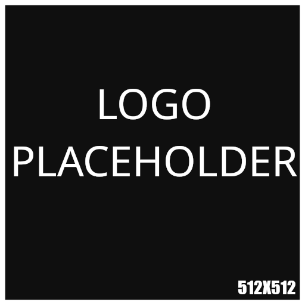

# THIS IS A README THAT WILL BE SHOWN ONCE THE PROJECT IS FINISHED

<h1 align="center">
  
   
  Circles Front Page
   
</h1>
<h3 align="center">Your homepage for <a href="https://osu.ppy.sh">osu!</a> tournaments</h5>
<h4 align="center">Made with</h5>

    
    
    </a>

  <a href="#features">Features</a> •
  <a href="#contributing">Contributing</a> •
  <a href="https://discord.gg/WsXtQ9YC2d">Discord</a>

# Features

- Popular tournaments on front page
- Match schedule with localized timestamps
- Match results
- Stats per team and per player
